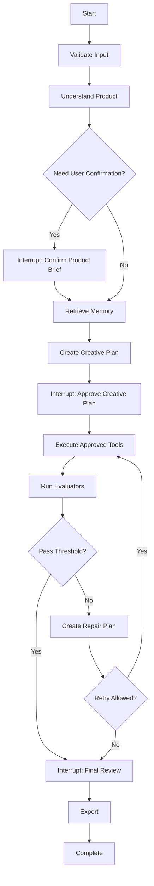

# Agent Runtime

| 属性 | 值 |
|---|---|
| 状态 | decision |
| 最后更新 | 2026-07-21 |
| 适用版本 | Agent Graph v1 |

## 设计目标

CommerceVision Agent 是一个单一编排 Agent。它通过显式 Graph 运行，不依赖模型自由循环决定所有事情。



## Agent State

状态使用版本化 Pydantic Model：

```text
AgentState
  workflow_id
  workflow_version
  product_brief_ref
  brand_context_refs[]
  retrieved_asset_refs[]
  creative_plan_ref
  approved_plan_version
  generation_attempt_refs[]
  evaluation_report_refs[]
  repair_plan_refs[]
  human_feedback_refs[]
  budget
  retry_policy
  current_node
  context_version
```

大对象和敏感正文不直接塞入 Checkpoint。State 保存 MySQL/OSS 引用、摘要、哈希和版本。

## 节点职责

| 节点 | 模型自主性 | 确定性约束 |
|---|---|---|
| Validate Input | 无 | 文件、权限、Schema、配额 |
| Understand Product | 中 | 输出 ProductBrief Schema |
| Retrieve Memory | 低 | 服务端过滤、Top-K 和许可检查 |
| Create Creative Plan | 中 | CreativePlan Schema、工具白名单 |
| Approve Plan | 人工 | 版本、身份和一次性审批 Token |
| Execute Tools | 低 | 只能执行已批准参数 |
| Evaluate | 混合 | 确定性规则 + 模型评分 |
| Reflect | 中 | RepairPlan Schema、重试边界 |
| Final Review | 人工 | 未批准不能导出 |
| Export | 无 | 平台规则和文件转换 |

## Checkpoint

LangGraph Checkpoint 使用自定义 MySQL `BaseCheckpointSaver`：

- Checkpoint Key：`thread_id + checkpoint_namespace + checkpoint_id`。
- 写入使用 MySQL 事务和唯一键。
- 保存序列化状态、metadata、parent checkpoint 和 channel writes。
- 支持 `get_tuple`、`list`、`put`、`put_writes` 和异步接口。
- Checkpoint 行与 Workflow 版本关联。
- 通过 TTL 清理任务级 Checkpoint。

Checkpoint 不负责：

- 业务权限。
- 订单式状态约束。
- 供应商幂等。
- 审批审计。
- 资产生命周期。

这些仍由领域表和服务控制。

## Human-in-the-loop

Interrupt 需要：

- 明确 `interrupt_type`。
- 当前状态版本。
- 可编辑字段 Schema。
- 允许操作。
- 过期时间。
- 审批者身份。

Resume 时必须携带 `expected_workflow_version`。旧页面或重复请求不能覆盖新状态。

## 工具调用

Agent 输出的是工具意图：

```json
{
  "tool": "generate_image",
  "argumentsRef": "oss://...",
  "reason": "Create Amazon MAIN candidate",
  "expectedOutput": "ImageCandidate",
  "policyVersion": "tool-policy-v1"
}
```

服务端 Tool Gateway 再完成：

- 工具存在性检查。
- 参数 Schema 校验。
- 用户和 Workflow 权限。
- 资产引用解析。
- 预算、配额和内容策略。
- 幂等键生成。

## Context Engineering

上下文由 `ContextBuilder` 统一构造：

1. 固定系统政策。
2. 当前节点目标。
3. 结构化商品摘要。
4. 已批准品牌约束。
5. 检索素材摘要和引用。
6. 最近必要的工具结果。
7. 输出 Schema。

禁止把完整历史 Trace、全部 OCR 文本或任意外部说明无限追加到 Prompt。

## 反思边界

- 最大自动修正次数默认 2，可按工作流配置。
- 内容安全拒绝不能通过更换供应商绕过。
- 商品结构错误只能调整允许字段。
- 相同失败原因连续出现时停止自动循环。
- 达到预算、时间或次数上限后进入人工处理。

## 可测试性

每个节点必须支持：

- 纯输入输出单元测试。
- 固定模型响应 Fixture。
- Schema 失败测试。
- Prompt/模型版本回放。
- 工具失败注入。
- Checkpoint 恢复测试。

