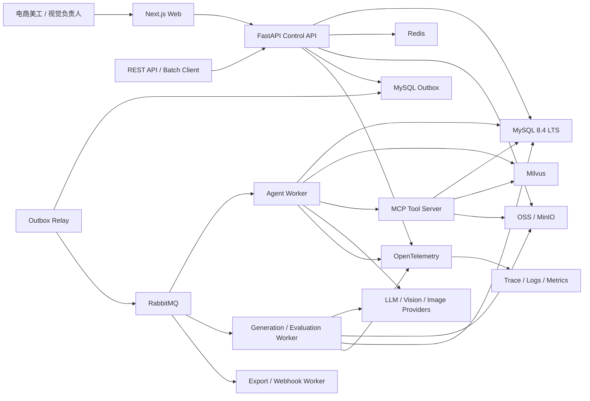

# 系统架构

| 属性 | 值 |
|---|---|
| 状态 | decision |
| 最后更新 | 2026-07-21 |
| 适用版本 | Architecture v1 |

## 架构风格

采用**模块化控制面 + 独立 Agent/任务 Worker + 托管数据服务**。

不在第一天拆成大量微服务，但运行职责必须可独立部署：

- Web。
- Control API。
- Agent Worker。
- Generation/Evaluation Worker。
- Outbox/Recovery Scheduler。
- MCP Server。

这些进程可以来自同一个 Python 代码库，以不同入口运行和扩容。

## 系统上下文

## 运行组件

### Next.js Web

- 商品和素材工作台。
- Creative Plan 编辑和审批。
- 候选图对比。
- Agent Trace 时间线。
- Evaluator 结果和失败证据。
- Prompt/模型/品牌配置管理。
- 公开演示模式。

Web 不直接调用模型、Milvus、OSS 管理接口或 MCP 工具。

### FastAPI Control API

- 身份认证和权限。
- 商品、资产和项目管理。
- Workflow 创建、查询、取消和审核。
- 模型、Prompt、工具和数据集配置。
- REST API、SSE、Webhook。
- MySQL 事务和 Outbox 写入。

API 不执行长时间模型调用，也不在响应返回后启动不可恢复后台任务。

### Agent Worker

- 加载 LangGraph。
- 从 MySQL Checkpoint 恢复上下文。
- 执行分析、检索、规划和反思节点。
- 触发人工 Interrupt。
- 调用受控 Tool Registry/MCP。
- 记录节点 Trace、输入摘要和版本。

### Generation/Evaluation Worker

- 执行图片生成和编辑。
- 轮询异步供应商任务。
- 运行文件、OCR、商品一致性和平台规则 Evaluator。
- 处理大图片、CPU 密集和外部 API 长任务。

### Outbox/Recovery Scheduler

- 发布事务 Outbox。
- 扫描超时 Step 和过期 Lease。
- 对账未知供应商任务。
- 清理 72 小时任务数据。
- 发送到期提醒。

### MCP Server

第一阶段提供受控业务工具：

- `get_product`。
- `search_reference_assets`。
- `get_brand_guidelines`。
- `create_export_manifest`。

MCP 用于展示标准工具协议和边界治理，不把内部所有函数机械包装成 MCP。

## 数据职责

| 组件 | 保存内容 | 是否事实来源 |
|---|---|---|
| MySQL | 用户、商品快照、Workflow、Step、审批、版本和审计 | 是 |
| Milvus | 图片向量、检索索引和分区 | 否 |
| Redis | 缓存、限流、短租约和实时事件游标 | 否 |
| RabbitMQ | 至少一次投递的任务消息 | 否 |
| OSS | 原图、候选图、模型文件和导出包 | 对象内容事实来源 |
| Trace 系统 | 调用链和模型观测数据 | 观测来源，不驱动业务状态 |

## 一致性原则

- 业务写入和 Outbox 必须在同一个 MySQL 事务。
- Milvus 索引由事件异步更新，可重建。
- 消息重复是正常情况，消费者必须幂等。
- Redis 丢失不能造成 Workflow 丢失。
- Trace 写入失败不能回滚业务任务，但必须告警。
- LangGraph Checkpoint 用于恢复 Agent 上下文，Workflow 表用于约束业务状态，两者不能互相替代。

## 扩展边界

只有出现以下情况才拆独立服务：

- 独立资源或伸缩需求。
- 独立安全/合规边界。
- 独立发布频率。
- 明确团队所有权。
- 单体模块已经形成稳定契约。

