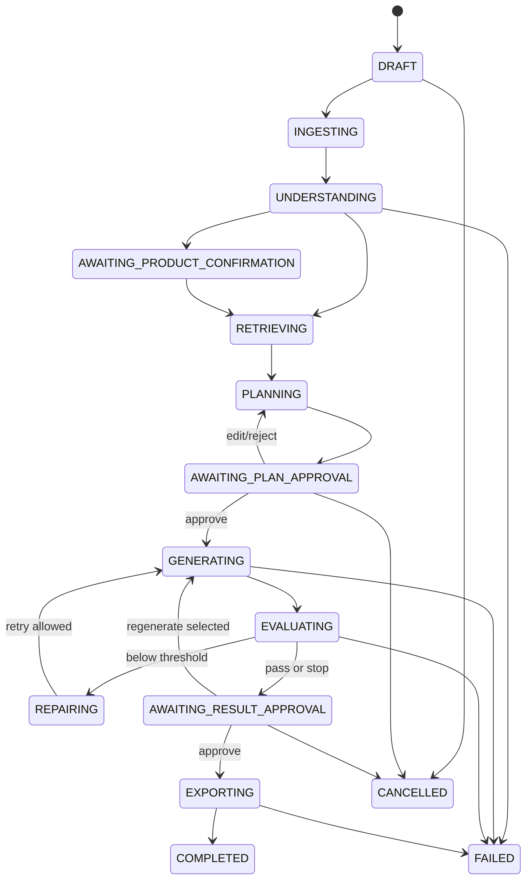

# 工作流状态机

| 属性 | 值 |
|---|---|
| 状态 | decision |
| 最后更新 | 2026-07-21 |
| 适用版本 | Workflow v1 |

## 业务状态



## 保留状态

业务状态与数据保留状态独立：

```text
ACTIVE -> EXPIRING -> DELETING -> EXPIRED
```

- 任务数据默认从 Workflow 创建起保存 72 小时。
- 60 小时发送到期提醒。
- 72 小时停止新工具调用并清理任务输入、正文和输出。
- 品牌资产、Prompt 模板、模型配置和公开评测集不属于任务数据。

## Step 状态

```text
PENDING
  -> QUEUED
  -> CLAIMED
  -> RUNNING
  -> WAITING_HUMAN
  -> SUCCEEDED
  -> RETRYABLE_FAILED
  -> FAILED
  -> CANCELLED
```

每个 Step 包含：

- `expected_workflow_version`。
- `lease_owner`。
- `lease_expires_at`。
- `attempt_count`。
- `max_attempts`。
- `error_class`。
- `input_ref` 和 `output_ref`。

## Generation Attempt 状态

```text
CREATED -> SUBMITTING -> SUBMITTED -> POLLING -> SUCCEEDED
                    \-> UNKNOWN
                    \-> RETRYABLE_FAILED
                    \-> PERMANENT_FAILED
                    \-> CANCELLED
```

`UNKNOWN` 表示供应商是否已经受理无法确定。此状态必须优先对账，不能直接重发。

## 状态转换规则

- 所有转换由领域服务执行，不能由 Controller 直接更新字符串。
- 更新必须比较 `version`。
- 状态、Step 更新和 Outbox 事件在同一 MySQL 事务。
- 完成状态不能回到执行状态；返工创建新 Step/Attempt。
- 人工审批保存不可变快照，后续编辑产生新版本。
- 迟到供应商回调只能更新匹配的有效 Attempt。

## 取消

取消请求：

1. 原子设置 Workflow `cancellation_requested_at`。
2. 阻止新 Step 认领。
3. 尽力取消供应商任务。
4. 已返回结果可保存为取消后的审计对象，但不能进入导出。
5. 释放临时资源并发布取消事件。

## 恢复

Recovery Scheduler 扫描：

- Lease 已过期的 `CLAIMED/RUNNING` Step。
- `SUBMITTED/POLLING` 超过供应商时限的 Attempt。
- 未发布 Outbox。
- Workflow 与 Checkpoint 当前节点不一致。
- 到期但未清理的任务数据。

恢复器根据数据库事实创建新任务消息，不直接修改模型输出。

