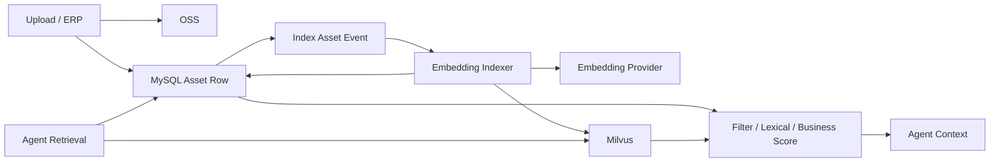

# 数据架构

| 属性 | 值 |
|---|---|
| 状态 | decision |
| 最后更新 | 2026-07-21 |
| 适用版本 | Data v1 |

## 选型

| 能力 | 技术 | 角色 |
|---|---|---|
| 事务与业务状态 | MySQL 8.4 LTS | 唯一业务事实来源 |
| 向量检索 | Milvus | 可重建的图片向量索引 |
| 缓存与限流 | Redis | 非事实状态 |
| 消息队列 | RabbitMQ | 至少一次任务投递 |
| 对象存储 | OSS / MinIO | 图片和大对象内容 |
| Trace 与指标 | OpenTelemetry 后端 | 观测数据 |

## 为什么 MySQL 与 Milvus 分离

MySQL 负责：

- 强事务。
- 唯一约束。
- 状态机版本控制。
- 审批和审计。
- Outbox/Inbox。
- Agent Checkpoint。

Milvus 负责：

- 图片和多模态 Embedding。
- ANN 检索。
- 向量分区和索引。
- 多 Embedding 模型并存。

系统不依赖 MySQL 原生向量能力。这样可以稳定使用 MySQL LTS，同时保持专业的多模态检索能力。

## 数据流

## 一致性模型

### MySQL 到 Milvus

- 资产事务提交时写 `asset_index_requested` Outbox。
- Indexer 生成 Embedding 并 upsert Milvus。
- 成功后更新 MySQL `embedding_status` 和版本。
- 删除资产时先标记不可检索，再异步删除向量。
- Milvus 全量丢失时可以从 MySQL + OSS 重建。

允许短时间最终一致，但未授权或已删除资产必须在 MySQL 过滤阶段被剔除。

### MySQL 到 RabbitMQ

- API 不直接发布业务消息。
- Workflow/Step 和 Outbox 在同一事务写入。
- Relay 发布后记录 broker message ID。
- 发布后崩溃可能重复消息，Inbox 负责去重。

### MySQL 与 Checkpoint

- Workflow 行是业务状态。
- Checkpoint 行是 Agent Runtime 快照。
- 状态转换事务同时记录目标节点和 Checkpoint 关联。
- 恢复器检测不一致并停止自动推进，不能凭 Checkpoint 覆盖业务状态。

## 对象存储

### Task Bucket

- 保存任务原图、Prompt/分析正文、候选图、中间图和导出包。
- 私有访问。
- 禁用版本控制。
- 默认 72 小时生命周期。
- Workflow 级数据密钥加密。

### Foundation Bucket

- 保存品牌素材、Prompt 模板、模型配置、授权参考素材、公开评测素材和注册 LoRA。
- 私有访问。
- 启用版本控制。
- 删除保护；生命周期由管理员删除或权利到期驱动。
- 记录许可证和权利元数据。

### Public Demo Bucket

- 只保存允许公开展示的结果。
- 通过 CDN 或签名 URL 访问。
- 与生产任务 Bucket 隔离。
- 防盗链、限速和流量告警。

## 敏感正文

以下内容不直接作为长期 MySQL 文本字段保存：

- 原始 Prompt。
- OCR 全文。
- 商品完整描述。
- 模型原始响应。
- 人脸和人物描述。

任务正文加密后写 Task Bucket，MySQL 保存引用、哈希、摘要和到期时间。

## 备份

- MySQL：自动备份、PITR、季度恢复演练。
- Foundation OSS：版本控制和跨可用区持久性。
- Task OSS：不因备份突破 72 小时要求。
- Milvus：定期备份索引元数据，但仍以可重建为设计前提。
- Redis/RabbitMQ：使用高可用配置，不能替代 MySQL 恢复。

## 数据生命周期

| 数据 | 生命周期 |
|---|---|
| 任务输入、正文、候选图和导出 | Workflow 创建后 72 小时 |
| Agent Checkpoint 和节点 payload | Workflow 创建后 72 小时 |
| 脱敏 Workflow tombstone | 180 天 |
| 脱敏审计事件 | 180 天 |
| 用户和权限 | 账号删除前 |
| 品牌资产、Prompt 模板、模型配置、授权参考素材和注册 LoRA | 管理员删除或权利到期，以先发生者为准 |
| 公开评测集 | 管理员删除、版本退役或权利到期，以先发生者为准 |
| Milvus 向量 | 对应资产有效期间 |

任务资产与基础资产的正式边界见 [ADR-006](../07-decisions/ADR-006-asset-retention-boundary.md)。
