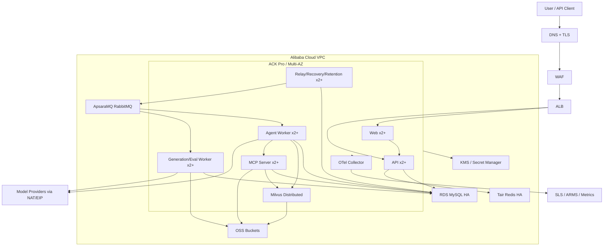

# 部署拓扑

| 属性 | 值 |
|---|---|
| 状态 | decision |
| 最后更新 | 2026-07-21 |
| 适用版本 | Deployment v1 |

## 环境

| 环境 | 目标 | 数据 |
|---|---|---|
| local | 开发和确定性测试 | 合成/公开样本 |
| ci | 单元、集成和 Contract | 临时容器 |
| staging | 真实模型集成、Eval、发布验证 | 授权固定数据集 |
| demo | 公开访问和作品展示 | 公开授权数据 |
| production | 企业私有部署 | 企业业务数据 |

所有环境使用同一代码、镜像和迁移，禁止维护“演示专用逻辑分支”。

## 本地

Docker Compose：

- Web。
- API。
- Worker。
- Scheduler。
- MCP Server。
- MySQL。
- Redis。
- RabbitMQ。
- Milvus Standalone。
- MinIO。
- OpenTelemetry Collector。
- 本地 Trace/日志后端。

真实模型通过 `.env.local` 或 Mock Provider 选择。Secret 不进入 Compose 文件。

## 阿里云拓扑

## ACK

- ACK Pro。
- 多可用区节点池。
- Web、API、Scheduler 和 MCP 至少 2 副本。
- Worker 按队列独立部署和 HPA。
- topology spread 和 anti-affinity。
- PodDisruptionBudget。
- `maxUnavailable: 0` 滚动发布。
- liveness 不依赖外部模型。
- readiness 检查进程、配置和必要内部依赖。
- 优雅关闭停止认领新任务并等待当前短阶段完成。

## MySQL

- RDS MySQL 8.4 LTS 或目标地域可用的兼容 LTS 版本。
- 高可用/多可用区。
- SSL。
- 自动备份和 PITR。
- 删除保护。
- 独立只读实例只在真实查询压力出现后启用。
- 连接池、慢查询和在线迁移策略。

## Milvus

### local/ci

- Milvus Standalone。

### staging/demo

- 可使用 Milvus Standalone 的持久化部署或托管 Milvus，前提是完成备份和容量验证。

### production

- Milvus Distributed。
- 独立节点池和资源限额。
- 对象数据存 OSS。
- 元数据/协调组件高可用。
- 备份、恢复和索引重建演练。

Milvus 故障不能影响 MySQL 中的审批、历史和任务查询。

## RabbitMQ

- 生产使用 ApsaraMQ for RabbitMQ 或经过验证的高可用 RabbitMQ。
- Publisher Confirm。
- Durable Queue。
- Dead Letter Exchange。
- Consumer Prefetch。
- 不使用消息 TTL 替代业务超时。
- Celery Task 只传 ID 和版本，不传图片或大型 Prompt。

## OSS

独立 Bucket：

- `task-assets`：72 小时，禁用版本控制。
- `foundation-assets`：版本控制、删除保护。
- `public-demo-assets`：只放可公开数据。
- `milvus-data`：Milvus 对象数据。
- `audit-export`：必要的脱敏合规导出。

## 网络

- RDS、Tair、RabbitMQ 和 Milvus 仅 VPC 访问。
- Provider 出站走固定 NAT/EIP。
- NetworkPolicy 默认拒绝。
- MCP Server 只接受内部 ServiceAccount。
- OSS 通过私网 Endpoint。
- 公开 Demo 和企业 production 使用不同账号/VPC/Secret。

## 初始生产规格原则

规格通过压测确定，不在架构文档承诺固定型号：

- 控制面保证两副本。
- Worker 容量按 Queue Age 和 Provider 配额伸缩。
- Milvus 根据向量数量、维度和索引压测。
- MySQL 根据连接、事务和存储评估。
- 不部署自有 GPU，第一阶段使用第三方模型 API。

## 灾备

- 当前目标是同地域多可用区。
- 地域级故障不在首个公开版本承诺内。
- Terraform、Helm、配置和数据库迁移进入 Git。
- MySQL 和基础资产定期恢复演练。
- Milvus 必须证明可恢复或可从 MySQL/OSS 重建。
